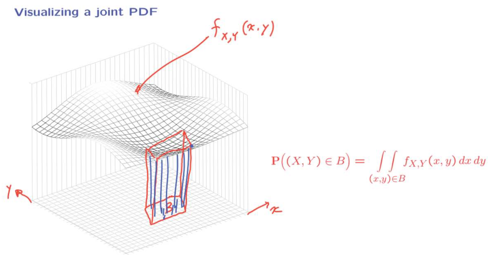

- [3.1 连续随机变量和概率密度函数（Probability Density Function，PDF）](#31-连续随机变量和概率密度函数probability-density-functionpdf)
  - [3.1.1 期望和方差](#311-期望和方差)
- [3.2 分布函数（Cumulative Distribution Function, CDF）](#32-分布函数cumulative-distribution-function-cdf)
  - [3.2.1 CDF 的性质](#321-cdf-的性质)
- [3.3 多个随机变量的联合概率](#33-多个随机变量的联合概率)
  - [3.3.1 联合概率密度函数（Joint PDFs, JPDF）](#331-联合概率密度函数joint-pdfs-jpdf)
  - [3.3.2 JPDF 的性质](#332-jpdf-的性质)
  - [3.3.3 边缘概率密度函数（Marginal PDFs，MPDF）](#333-边缘概率密度函数marginal-pdfsmpdf)
  - [3.3.4 联合分布函数（Joint CDFs，JCDF）](#334-联合分布函数joint-cdfsjcdf)
  - [3.3.5 多个随机变量下的期望](#335-多个随机变量下的期望)
- [3.4 条件](#34-条件)
  - [3.4.1 以事件为条件的随机变量](#341-以事件为条件的随机变量)
  - [3.4.2 一个随机变量对另一个随机变量的条件](#342-一个随机变量对另一个随机变量的条件)
  - [3.4.3 c.r.v. 的条件期望、全概率全期望定理](#343-crv-的条件期望全概率全期望定理)
- [3.5 独立性](#35-独立性)
- [3.6 连续贝叶斯准则](#36-连续贝叶斯准则)
  - [3.6.1 关于离散随机变量的推断](#361-关于离散随机变量的推断)
  - [3.6.2 基于离散观察值的推断](#362-基于离散观察值的推断)
- [3.7 正态随机变量](#37-正态随机变量)
  - [3.7.1 标准正态](#371-标准正态)
  - [3.7.2 正态 r.v. CDF 的计算](#372-正态-rv-cdf-的计算)
  - [3.7.3 独立的正态 r.v.](#373-独立的正态-rv)
- [3.8 常见的连续随机变量](#38-常见的连续随机变量)
  - [3.8.1 连续的均匀随机变量](#381-连续的均匀随机变量)
  - [3.8.2 二维均匀随机变量的 PDF](#382-二维均匀随机变量的-pdf)
  - [3.8.3 指数随机变量](#383-指数随机变量)
  - [3.8.4 指数随机变量的无记忆](#384-指数随机变量的无记忆)

### 3.1 连续随机变量和概率密度函数（Probability Density Function，PDF）
随机变量是实验结果的函数，d.r.v. 的取值范围（值域）为有限个或无限可列个值，c.r.v 的取值范围可以为无限个值；

PMF 的定义：$p_X(x)=P({X=x})$（花括号可省），表示单点的概率；

PDF 的定义：PDF 是通过 $P(X\in B)=\int_Bf_X(x)dx$ 定义的，它表示 X 在区间 B 的概率为 $f_X(x)$ 在区间 B 上的积分，其中 $f_X(x)$ 即为 PDF。（c.r.v 中单点概率为 0，无法定义 PDF）
>c.r.v 的定义：如果一个 r.v. 可以描述成 PDF 的形式，那么这个 r.v. 是连续的

下面是 PDF 的一些性质：
|Discrete|Continuous|
|---|---|
|$P(a\leqslant X\leqslant b)=\sum_{x:a\leqslant x\leqslant b}p_X(x)$|$P(a\leqslant X\leqslant b)=\int_a^bf_X(x)dx$|
|$p_X(x)\geqslant 0$|$f_X(x)\geqslant 0$|
|$\sum_xp_X(x) = 1$|$\int_{-\infin}^\infin f_X(x)dx = 1$|

- $P(a\leqslant X\leqslant a+\delta)\approx f_X(a)·\delta$；
  >$f_X(x)$ 可以理解为落入 x 附近的单位长度的概率
- $P(X=a) = \int_a^af_X(x)dx = 0$
  
  $P(a\leqslant X \leqslant b) = P(a<X\leqslant b)=P(a\leqslant X<b)=P(a<X<b)$
  >单点概率为 0

#### 3.1.1 期望和方差
随机变量的期望可以看作是所有可能的取值对每个取值的概率进行加权。对于离散型随机变量，权就是对应的概率 $p_X(x)$；对于连续型随机变量，由 PDF 的性质可知，可将 $f(x)dx$ 看作随机变量落在 $X=x$ 附近的概率，即 $X=x$ 时的权值；
>[期望定义参考](https://www.zhihu.com/question/307660919)

|Discrete|Continuous|
|---|---|
|$E[X]=\sum_xxp_X(x)$|$\pmb{E[X]=\int_{-\infin}^\infin xf_X(x)dx}$|
|$var(x)=E[(X-\mu)^2]=\sum_x(x-\mu)^2p_X(x)$|$var(x)=E[(X-\mu)^2]=\int_{-\infin}^\infin (x-\mu)^2f_X(x)dx$|
>$\mu=E[X]$

期望和方差的性质：
- $\text{IF }X \geqslant 0，\text{then } E[X] \geqslant 0$；

- $\text{IF }a\leqslant X \leqslant b，\text{then }a \leqslant E[X]\leqslant b$；

- 期望规则：$E[g(X)] = \int_{-\infin}^\infin g(x)f_X(x)dx$ (**证明**)

- 期望和方差的线性法则： (**证明**)
  - $E[aX+b] = aE[X] + b$
  - $var(aX+b) = a^2var(X)$

- 计算方差的另一公式：$var(X) = E[X^2] -(E[X])^2$ (**证明**)

### 3.2 分布函数（Cumulative Distribution Function, CDF）
PMF（分布列）可用于刻画离散 r.v. 的取值规律。PDF（概率密度函数）可用于刻画连续 r.v. 的取值规律。CDF（分布函数）可用于刻画 r.v. 的取值规律，无论连续还是离散；
$$
F_X(x) = P(X\leqslant x)=
\begin{cases}
\sum_{k\leqslant x}P_X(k),\,\, \text{若X是离散的} \\[2ex]
\int_{-\infin}^x f_X(t)dt,\,\, \text{若X是连续的}
\end{cases}
$$

#### 3.2.1 CDF 的性质

- $F_X$ 是单调非减函数；

- $x\to-\infin$ 时，$F_X\to 0$；$x\to\infin$ 时，$F_X\to 1$；

- X 为 d.r.v. 时，$F_X(x)$ 为 x 的阶梯型函数且保持右连续；

- X 为 c.r.v. 时，$F_X(x)$ 为 x 连续函数；

- X 为 d.r.v. 且取整数值时，CDF 和 PMF 可以利用求和或差分互求：

  $$
    F_X(k) = \sum_{i=-\infin}^kp_X(i),\nonumber\\
    p_X(k) = P(X\leqslant k)-P(X\leqslant k-1)=F_X(k)-F_X(k-1)\nonumber
  $$
  >k 为任意整数
- X 为 c.r.v. CDF 和 PDF 可以利用积分或微分互求：
  $$
  F_X(x)=\int_{-\infin}^x f_X(t)dt,\,\,f_X(x)=\frac{dF_X}{dx}(x)
  $$
  >第二个等式只在 CDF 可微的那些点上成立

### 3.3 多个随机变量的联合概率

#### 3.3.1 联合概率密度函数（Joint PDFs, JPDF）

对于两个 r.v. 的情况，只了解它们各自的 PDF 是不够的，我们需要通过 joint PDF 对两个 r.v. 的关系进行建模，它是对 joint PMF 的连续模拟：

接下来实际定义这个对象，并看看如何使用它。首先回顾一下 joint PMF 的定义以及它的计算，模拟出 joint PDF 的定义及计算（将求和变为积分，PMF 变为 PDF）：
|joint PMF| joint PDF|
|---|---|
|$p_{X,Y}(x,y)=P(X=x \text{ and }Y=y)\geqslant0$|$f_{X,Y}(x,y)\geqslant 0$|
|$P((X,Y)\in B)=\sum\sum_{(x,y)\in B}p_{X,Y}(x,y)$|$P((X,Y)\in B)=\iint_{(X,Y)\in B} f_{X,Y}(x,y)dxdy$
|$\sum_x\sum_yp_{X,Y}(x,y)=1$|$\int_{-\infin}^\infin\int_{-\infin}^\infin f_{X,Y}(x,y)dxdy=1$

joint PDF 告诉我们概率单元是如何分布在连续的二维平面上的，某一集合顶部的 joint pdf 下的体积为这一集合的概率，这就是 joint pdf 计算公式的含义；

#### 3.3.2 JPDF 的性质
- JPDF 的进一步理解：
  

  对于 $P((X,Y)\in B)=\iint_{(X,Y)\in B}f_{X,Y}(x,y)dxdy$ 
  - 当 B 为矩形时，
    $$
    P(a\leqslant X \leqslant b,c\leqslant Y\leqslant d) = \int_c^d\int_a^bf_{X,Y}(x,y)dxdy
    $$
  - 如果 B 为一个非常非常小的矩形，则有：
  $$
    P(a\leqslant X \leqslant a+\delta,c\leqslant Y\leqslant c+\delta) \approx f_{X,Y}(a,c)·\delta^2
  $$
  由此，可根据小矩形的概率对 joint PDF 进行理解：joint PDF 不是概率，它是概率的密度，它告诉我们单位面积的概率；

- 对于单个的连续 r.v.，有单点的概率为 0，对于两个联合连续的 r.v. 来说也是如此，但还可以更进一步，
  $$
  area(B) = 0\rArr P((X,Y)\in B) = 0
  $$
  比如，当 B 为一条曲线时，位于曲线顶部的 joint PDF 下的体积为 0，所以相应的概率为 0；

- 一个合法的 joint PDF 是两个变量的任意函数，它需要满足非负并且积分为 1；

- 如果两个随机变量可以描述为一个 joint PDF，那么这两个随机变量是联合连续的。假设 X 是一个连续 r.v.，Y=X，则 Y 也是一个连续 r.v.，在这种情况下，所有的概率都将集中在 y=x 这条线上，此时在面积为 0 的区域上有正概率，这说明 Y=X 不是联合连续的。它们中的每一个都连续，但 Y=X 不是联合连续，本质上，联合连续出了要求两个变量都连续外，还要求概率分布在二维平面上，不能集中在一维集合中；

#### 3.3.3 边缘概率密度函数（Marginal PDFs，MPDF）

在离散的情况下，可以从 joint PMF 得到 r.v..X 的 PMF 和 r.v..Y 的 PMF。joint PMF 中包含 X、Y 的完整的概率描述，因此在知道 joint PMF 的条件下可以得到 r.v..X 的 PMF 和 r.v..Y 的 PMF。类似的，将求和变为积分，PMF 变为 PDF 可以由 joint PDF 得到 r.v..X 的 PDF 和 r.v..Y 的 PDF：

|marginal PMF|marginal PDF|
|---|---|
|$p_X(x)=\sum_y P_{X,Y}(x,y)$|$\pmb{f_X(x)=\int f_{X,Y}(x,y)dy}$|
|$P_Y(y)=\sum_x P_{X,Y}(x,y)$|$\pmb{f_Y(y)=\int f_{X,Y}(x,y)dx}$|

$f_X(x) = \int f_{X,Y}(x,y)dy$ 的证明：

求 MPDF 的一个例子：

$$
x\in(2,3)时，f_X(x)=\int_{-\infin}^\infin f_{X,Y}(x,y)dy=\int_2^3\frac14dy = \frac14
$$

>JPDF 处于二维或多维，MPDF 处于一维，因为我们一次只计算一个变量。所以 MPDF 不需要满足 $area(B) = 0\rArr P((X,Y)\in B) = 0$

#### 3.3.4 联合分布函数（Joint CDFs，JCDF）
|(joint) CDF|(joint) PDF|
|---|---|
|$F_X(x)=P(X\leqslant x)=\int_{-\infin}^xf_X(t)dt$|$f_X(x)=\frac{dF_X}{dx}(x)$|
|$F_{X,Y}(x,y)=P(X\leqslant x, Y\leqslant y)=\int_{-\infin}^y\int_{-\infin}^xf_{X,Y}(s,t)dsdt$|$\pmb{f_{X,Y}(x)=\frac{\partial^2F_{X,Y}}{\partial x\partial y}(x,y)}$|

#### 3.3.5 多个随机变量下的期望

- $E[g(X,Y)]=\int_{-\infin}^\infin\int_{-\infin}^\infin g(x,y)f_{X,Y}(x,y)dxdy$；

- $E[aX+bY+c]=aE[X]+bE[Y]+c$；
  >可扩展至多于两个随机变量的情况

### 3.4 条件

#### 3.4.1 以事件为条件的随机变量
在某事件 A(P(A)>0) 发生的条件下，d.r.v. 中 CPMF 的定义：
$$
p_{X|A}(x)=P(X=x|A)=\frac{P(\{X=x\}\cap A)}{P(A)}
$$
>类似于 PMF 的定义，也是定义为单点的概率，不过 CPMF 是在 A 发生的条件下单点的概率

c.r.v. 中单点的概率为 0，无法用来定义 PDF，一般用一个区域的概率来对 PDF 进行定义，CPDF也同样如此，
$$
P(X\in B|A)=\int_B f_{X|A}(x)dx,\,\,\text{其中 }f_{X|A}(x)\text{ 为 CPDF}
$$

**CPDF 计算公式的推导**：令事件 $A = \{X\in A\}$，
当 $(x,x+\delta)\not\subset A$ 时，$P(x\leqslant X\leqslant x+\delta, X\in A) = 0$，此时的条件概率也为 0；

>图中红色的部分为 PDF 的图像，绿色的部分为 A 条件下的 PDF 的图像。两者图像相似，相差因子 $P(A)$

当 $(x,x+\delta)\subset A$ 时，有下式成立：

$$
\begin{align}
&P(x\leqslant X\leqslant x+\delta | X\in A)\approx f_{X|X\in A}(X)·\delta&\nonumber\\[1.5ex]
&=\frac{P(x\leqslant X\leqslant x+\delta,X\in A)}{P(A)}=\frac{P(x\leqslant X\leqslant x+\delta)}{P(A)}&\nonumber\\[1.5ex]
&\approx \frac{f_X(x)·\delta}{P(A)}\nonumber\\
\end{align}
$$

由上面的推导可得，条件 PDF 的公式，
$$
\\[2ex] f_{X|X\in A}(x) = 
\begin{cases}
0,\quad \text{if }\,\,x\notin A\\[2ex]
\frac{f_X(x)}{P(A)}, \text{if }\,\,x\in A
\end{cases}
$$

#### 3.4.2 一个随机变量对另一个随机变量的条件
首先回想一下在离散 r.v. 中，给定一个 r.v. 条件下的 CPMF(Conditional PMFs) 的公式：
$$
p_{X|Y}(x|y)=P(X=x|Y=y)=\frac{p_{X,Y}(x,y)}{p_Y(y)}, \,\,\text{IF } p_Y(y)>0
$$
在连续情况下，无法直接将 CPDF(Conditonal PDFs) 定义为联合概率除以条件的概率，因为连续 r.v. 在单点的概率为 0，不满足 $p_Y(y)>0$。下面的 CPDF 的定义：
$$
f_{X|Y}(x|y)=\frac{f_{X,Y}(x,y)}{f_Y(y)}, \,\,\text{IF } f_Y(y)>0
$$
>对 CPMF 第二个等式的模仿

下面的对这个定义的理解：首先回顾一下给定事件 A(P(A)>0) 的情况下的条件概率的定义：
$$
P(x\leqslant X\leqslant x+\delta|A)\approx f_{X|A}(x)·\delta,\,\,\text{where }P(A)>0
$$
由前面的内容可知，PDF 可以确定一个小区间内的概率，CPDF 同样如此。假设事件 A 为无限接近于某个给定的 Y 值（给定 Y 值的去心邻域），不能取 Y 值，因为单点概率为 0，此时的条件概率为两个事件同时发生的概率除以条件事件的概率，两个事件同时发生的概率为 $\epsilon$ 和 $\delta$ 组成的小矩形的概率，约等于 JPDF 乘以小矩形的面积，则有下面公式成立：
$$
\begin{align}
&P(x\leqslant X\leqslant x+\delta |y\leqslant Y\leqslant y+\epsilon)\approx \frac{f_{X,Y}(x,y)\delta\epsilon}{f_Y(y)\epsilon} &\nonumber\\
&=\frac{f_{X,Y}(x,y)\delta}{f_Y(y)} = f_{X|Y}(x|y)\delta&\nonumber
\end{align}
$$
从上面的公式可以得到，$f_{X|Y}(x|y)\delta$ 就是在给定 $Y\in[y,y+\epsilon]$ 的条件之下，$X \in [x,x+\delta]$ 的概率。由于 $f_{X|Y}(x|y)\delta$ 不依赖于 $\epsilon$，我们可以将 $f_{X|Y}(x|y)\delta$ 认为是 $\epsilon\to 0$ 的极限情况，即，
$$
P(x\leqslant X\leqslant x+\delta |Y=y)\approx f_{X|Y}(x|y)\delta, \,\,(\delta \text{较小})
$$
更一般地，有，
$$
P(X\in A |Y=y)=\int_Af_{X|Y}(x|y)dx
$$

对 CPDF 的进一步理解：

- $f_{X|Y}(x|y)\geqslant 0$。因为 $f_{X,Y}(x,y)\geqslant 0$ 且 $f_Y(y)\geqslant 0$；

- 当 Y 固定时，比如 Y=y，CPDF 的形状与 JPDF 的切片相似（相差因子 $f_Y(y)$）；

- 积分为 1；
  $$
  \int_{-\infin}^\infin f_{X|Y}(x|y)dx = \frac{\int_{-\infin}^\infin f_{X,Y}(x,y)dx}{f_Y(y)} = 1
  $$
  >由这个性质可以得到 Y 的 MPDF 的公式

- 乘法法则：
  
  $f_{X,Y}(x,y)=f_Y(y)·f_{X|Y}(x|y) = f_X(x)·f_{Y|X}(y|x)$；

#### 3.4.3 c.r.v. 的条件期望、全概率全期望定理
- X 在给定事件 A 之下的条件期望（P(A)>0）由下式定义：
  $$
  E[X|A]=\int_{-\infin}^\infin xf_{X|A}(x)dx
  $$
  给定 Y=y 之下的条件期望由下式定义
  $$
  E[X|Y=y]=\int_{-\infin}^\infin xf_{X|Y}(x|y)dx
  $$

- 期望规则 **（要会证）**
  $$
  E[g(X)|A]=\int_{-\infin}^\infin g(x)f_{X|A}(x)dx,\\
  E[g(X)|Y=y]=\int_{-\infin}^\infin g(x)f_{X|Y}(x|y)dx
  $$
- 全概率定理 **（要会证）**
  

  >对 CDF 求导可以得到 PDF，上式中，对 CDF 的全概率定理求导得到 PDF 的全概率定理；全概率定理两边同乘 x 得到全期望定理
- 全期望定理 **（要会证）** 

  设 $A_1,A_2,...,A_n$ 为互不相容的 n 个事件，对每个 i，$P(A_i)>0$，并且这些事件形成样本空间的一个分割，则
  $$
  E[X]=\sum_{i=1}^n P(A_i)E[X|A_i]
  $$
  相似地，有
  $$
  E[X]=\int_{-\infin}^\infin E[X|Y=y]f_Y(y)dy
  $$

### 3.5 独立性
独立性是概率论中的中心理论，它可以通过简单的模型构建出复杂的模型；首先回忆一下离散情况下的独立性定义：
$$
P_{X,Y}(x,y)=p_X(x)P_Y(y),\,\,\text{for all } x,y
$$
通过离散的定义类比出连续下的定义：
$$
f_{X,Y}(x,y) = f_X(x)f_Y(y),\,\,\text{for all } x \text{ and } y
$$
当 JPDF 等于 MPDF 的乘积时，X 和 Y 相互独立；

将上面的定义与乘法法则 $f_{X,Y}(x,y) = f_{X|Y}(x|y)f_Y(y)$ 进行比较，可得：
- 独立性等价于 $f_{X|Y}(x|y)=f_X(x), \text{ for all }y \text{ with } f_Y(y)>0 \text{ and all } x$；

如果连续的 r.v.X 和 r.v.Y 相互独立，对应有独立性的期望和方差公式：
- $E[XY] = E[X]E[Y]$；

- $var(X+Y) = var(X) + var(Y)$;

- $g(X)$ 和 $h(Y)$ 也相互独立，$E[g(X)h(Y)]=E[g(X)]·E[h(Y)]$

### 3.6 连续贝叶斯准则
假设我们有一个 r.v.X 表示一种无法观察到的量，设其 PDF 为 $f_X$，我们能够观察到经过噪声干扰后的 X，即 Y，当 Y 的值被观察到之后，它包含 X 的多少信息？即求 $f_{X|Y}(x|y)$；

利用公式 $f_{X,Y}=f_Xf_{Y|X}=f_Yf_{X|Y}$ 可得，
$$
f_{X|Y}(x|y)=\frac{f_X(x)f_{Y|X}(y|x)}{f_Y(y)}
$$
利用 PDF 的归一化性质 $\int_{-\infin}^\infin f_{X|Y}(x|y)dx=1$ 上式两边对 x 积分，求得 $f_Y(y)$，然后将求得的 $f_Y(y)$ 代回原式，则有，
$$
f_{X|Y}(x|y)=\frac{f_X(x)f_{Y|X}(y|x)}{\int_{-\infin}^\infin f_X(t)f_{Y|X}(y|t)dt}
$$

#### 3.6.1 关于离散随机变量的推断
>无法观察到的变量为 d.r.v.，观察到的经过噪声干扰的变量为 c.r.v.；

若无法观察到的变量为事件 A，观察到的为 c.r.v.Y，求 $p_{A|Y}(A|y)$
$$
\begin{align}
  &p_{A|Y}(A|y)\approx P(A|y\leqslant Y\leqslant y+\delta)=\frac{P(A)P(y\leqslant Y\leqslant y+\delta|A)}{P(y\leqslant Y\leqslant y+\delta)}&\nonumber\\
  &\approx \frac{P(A)f_{Y|A}(y)\delta}{f_Y(y)\delta}=\frac{P(A)f_{Y|A}(y)}{f_Y(y)}&\nonumber\\
  &=\frac{P(A)f_{Y|A}(y)}{P(A)f_{Y|A}(y)+P(A^c)f_{Y|A^c}f_{Y|A^c}(y)}\nonumber
\end{align}
$$

令 A={N=n}，N 为 d.r.v. 则有，
$$
p_{N|Y}(n|y)=\frac{P_N(n)f_{Y|N}(y|n)}{\sum_{i=1}^nP_N(i)f_{Y|N}(y|i)}
$$

>信号检测时可能遇到上述情况

#### 3.6.2 基于离散观察值的推断
>无法观察到的变量为 c.r.v.，观察到的经过噪声干扰的变量为 d.r.v.；

若无法观察到变量为 c.r.v.Y，观察到的经过噪声干扰的变量为事件 A，求 $f_{Y|A}(y)$
$$
\begin{align}
  &f_{Y|A}(y)=f_Y(y|A)=\frac{f_Y(y)P(A|Y=y)}{P(A)}&\nonumber\\
  &=\frac{f_Y(y)P(A|Y=y)}{\int_{-\infin}^\infin f_Y(t)P(A|Y=t)dt}&\nonumber
\end{align}
$$
>第三个等式解释：利用归一化性质，求出 P(A)，然后再代回原式

令 A={N=n}，N 为 d.r.v. 则有，
$$
f_{Y|N}(y|n)=\frac{f_Y(y)p_{N|Y}(n|y)}{\int_{-\infin}^\infin f_Y(t)p_{N|Y}(n|t)dt}
$$
>$p_{X|Y}(x|y)=P(X=x|Y=y)\rArr p_{N|Y}(n|y)=P(N=n|Y=y)$

>抛硬币

### 3.7 正态随机变量
对于 c.r.v. 如果它的 PDF 满足
$$
  f_X(x)=\frac{1}{\sqrt{2\pi}\sigma}e^{-\frac{(x-\mu)^2}{2\sigma^2}}
$$
则称 X 服从参数为 $(\mu,\sigma)$ 的正态(General normal)/高斯(Gaussian)分布，记为 $X\sim N(\mu,\sigma)$；
>如何证明它的归一化性质？

从 PDF 的定义可以看出，正态分布只依赖于总体的两个特征：$\mu$ 和 $\sigma$。当 $\mu=-1,\,\,\sigma=0.2$ 时，PDF 的图像为下图：

根据 PDF 的图像以及 PDF 的归一性可以得到，当 $\mu$ 固定时，$\sigma$ 越小，PDF 越大，由于面积恒为 1，所以图像会往内收缩，表现为数据越集中，这和方差的性质相契合；$\sigma$ 越大，曲线越扁平，反之，曲线越瘦高；

正态 r.v. 的性质：
- PDF 中的 $\mu$ 为正态 r.v. 的期望；$\sigma^2$ 为正态 r.v. 的方差；
  >证明？
- 线性变换之下随机变量的正态性保持不变；
  >证明？

#### 3.7.1 标准正态
令 $Y=\frac{X-\mu}{\sigma}$，可以得到 $E[Y]=0,\,\,var(Y)=1$，我们称 $Y$ 为标准正态，上述过程称为正态变量的标准化。标准正态的 CDF 用 $\Phi$ 进行表示如下，
$$
f_Y(y)=\frac{1}{\sqrt{2\pi}}e^{-\frac{y^2}{2}},\\
\Phi(y)=P(Y\leqslant y)=P(Y<y)=\frac{1}{\sqrt{2\pi}}\int_{-\infin}^ye^{-\frac{t^2}{2}}dt
$$
图像如下，

由图可得，$\Phi(-y)=1-\Phi(y),\,\,\forall \,y$；

#### 3.7.2 正态 r.v. CDF 的计算
利用标准正态分布表计算正态随机变量 $X$ 的分布函数的值的过程，先根据下述公式标准化：
$$
P(X\leqslant x)=P(\frac{X-\mu}{\sigma}\leqslant \frac{x-\mu}{\sigma})=P(Y\leqslant \frac{x-\mu}{\sigma})=\Phi(\frac{x-\mu}{\sigma})
$$
然后根据 $\frac{x-\mu}{\sigma}$ 的值进行查表，如果 $\frac{x-\mu}{\sigma}$ 的值为负数，则可使用 $\Phi(-y)=1-\Phi(y),\,\,\forall \,y$ 进行转化，然后再查表求值；

#### 3.7.3 独立的正态 r.v.

>JPDF 的形状像一口钟，中心为 $(\mu_x,\mu_y)$，但这口钟不是圆形的钟，在 x 轴和 y 轴方向上的宽度分别于 $\sigma_x$ 和 $\sigma_y$ 成正比

>标准正态的 JPDF 的形状为一口圆形的钟，中心为 $(0,0)$

### 3.8 常见的连续随机变量

#### 3.8.1 连续的均匀随机变量

$$
f_X(x)=\begin{cases}
  \frac{1}{b-a},&\text{IF } a\leqslant x\leqslant b,\\[2ex]
  0,&\text{otherwise},
\end{cases}
$$

$$
F_X(x)=\begin{cases}
  \frac{x-a}{b-a},&\text{IF } a\leqslant x\leqslant b,\\[2ex]
  0,&\text{otherwise},
\end{cases}
$$

$$
E[X]=\frac{a+b}{2},\,\,var(X)=\frac{(b-a)^2}{12}
$$

#### 3.8.2 二维均匀随机变量的 PDF

$S$ 是二维平面的一个子集
$$
f_{X,Y}(x,y)=
\begin{cases}
  \frac{1}{S\text{ 的面积 }},&\text{ IF } (x,y)\in S,\\[2ex]
  0,&\text{otherwise},
\end{cases}
$$

例如，半径为 $r$，圆心为 $(0,0)$ 的圆的均匀分布为，
$$
f_{X,Y}(x,y)=
\begin{cases}
  \frac{1}{\pi r^2},&\text{ IF } x^2+y^2\leqslant r^2,\\[2ex]
  0,&\text{otherwise},
\end{cases}
$$

#### 3.8.3 指数随机变量

>归一性的证明？

由于 $P(X\geqslant a) = e^{-\lambda a}$，可得 $P(X\leqslant a)=1-e^{-\lambda a}$，所以 $F_X(x)=1-e^{-\lambda x}$。也可以用 $CDF$ 的定义求解指数随机变量的 $F_X(x)$ 可得到相同的结果 $(a\geqslant0,\,\,x\geqslant0)$；

#### 3.8.4 指数随机变量的无记忆

>第三个等式相等的原因，要使 $T>t+x,\,\,T>t$ 同时成立，只需 $T>t+x$ 成立即可，因为 $x$ 恒大于等于零

从上图的推导可以发现，用过的灯泡，再用 $x$ 个单位时间的概率与新灯泡再用 $x$ 个单位时间的概率相同，因此，从概率上说，新灯泡和旧灯泡是相同的，换言之，使用过的灯泡不记得它使并且不受其使用过的时间所影响，这就是指数随机变量的无记忆性；

>红色箭头相等是因为指数分布的无记忆性

当灯泡还亮着时，那么在接下来的 $\delta$ 时间内，它烧坏的概率为 $\lambda\delta$。就像抛硬币一样，每 $\delta$ 个时间步，$P(\text{success})=\lambda\delta$，这里的成功意味着灯泡烧坏了。从这个意义上讲，指数随机变量与几何随机变量非常相似，后者是在离散背景下直到第一次成功的概率；
