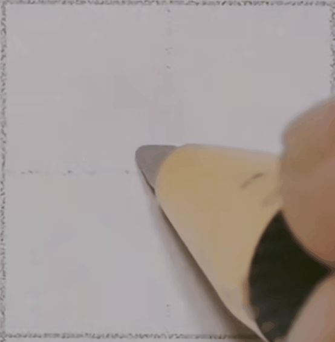
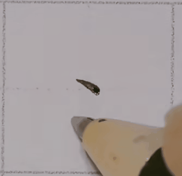
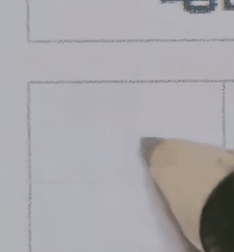
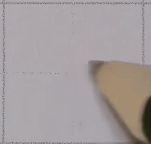

五度法分析笔画：从长度、角度、弧度、力度和速度五个方面对笔画进行分析

- 右点：长度较短，有一定倾斜度，上部拱起、下部稍平，由轻到重。凌空起势、起笔轻落、右下行笔。
  
  

  >关于右点的回锋：根据字帖进行选择；如果你使用的笔比较细，想要写出明显的粗细变化也可以选择回锋；

  
  
- 左点：和右点非常像，也是凌空起势、起笔轻落，但是左下行笔，最后有一个顿笔或者回锋。
  
  
  
- 撇点：角度和左点非常相似，没有太大的弧度，但是有一个转折。右下行笔、左下出锋、先轻后重再轻
  
  
  
- 挑点：长度上相对较短。先右下行笔、右上挑出、轻重轻，右下的时候比较慢，右上挑出的时候较快
  
  
  
- 点的组合：
  
  - 相向点
  
    
  
  - 相背点上下点
  
    
  
  - 两点水三点水
  
    
  
  - 学三点
  
    
  
  - 下四点聚四点
  
    
  
  

