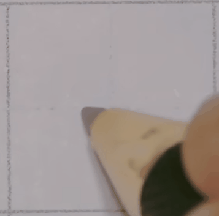
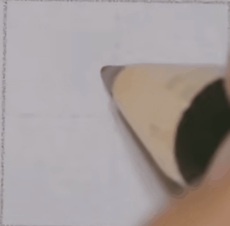

- 短横：长度相对较短，有一定斜度，一般情况下短横要比长横倾斜一点，基本没有太大的弧度，是一个比较直的状态，力度上由轻到重，速度写起来比较快。凌空取势、由轻到重（具体的轻重要根据所写的字来进行调整）
  
  
  
- 长横：长度相对较长，有一定角度，中间稍微有一点弧度，轻入笔，力度上轻重轻重，行笔速度相对较快，这样中间就能稍微细点，最后再加重或者回锋
  
  
  
  > 注意：不要用手腕拖着向右行笔，而是用拇指摁压笔，向右推出去，这样容易写直一些；写竖也同理，用食指的力量向下行笔，主要是反复练习。
- 垂露竖：起笔与右点类似，右下行笔，向下转折，最后再回一下锋。写短竖时，当下面有横时一般不需要垂露，没有横时一般都要加垂露。
  
  
  
- 悬针竖：起笔与右点类似，右下行笔，再向下转折，不要往里面收一下再转，这样写出来很难看，力度轻重轻。
  
  